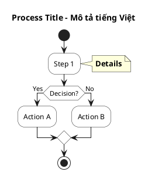

# BPMN Process Diagrams - E2E Physical Gift Management

**Dự án:** E2E Physical Gift Management System  
**Mục đích:** Tài liệu hóa các quy trình nghiệp vụ bằng BPMN diagrams sử dụng PlantUML  
**Ngày tạo:** 2025-10-04

---

## Tổng quan

Thư mục này chứa các BPMN diagrams cho 12 quy trình chính của hệ thống E2E Physical Gift Management. Mỗi diagram được tạo bằng PlantUML format để:

- **Dễ version control** (text-based)
- **Tự động generate** diagram từ source code
- **Dễ maintain** và update khi nghiệp vụ thay đổi
- **Integrate** với documentation tools

---

## Danh sách BPMN Diagrams

### Phase 1 - MVP (Implemented)

| # | File Name | Quy Trình | Status | Epic |
|---|---|---|---|---|
| **B1** | `B1_Gift_Planning_Scheme_Setup.puml` | Gift Planning & Scheme Setup | ✅ Implemented | Epic 1 |
| **B2** | `B2_Gift_Delivery_Agency_Warehouse.puml` | Gift Delivery to Agency Warehouse | ✅ Implemented | Epic 2 |
| **B3** | `B3_Gift_Delivery_Stores.puml` | Gift Delivery to Stores | ⚠️ Simplified | Epic 2 |
| **B4** | `B4_Campaign_Readiness_Gate.puml` | Campaign Readiness Gate | 📋 Planned | Epic 2 |
| **B5** | `B5_Gift_Distribution_PG.puml` | Gift Distribution (PG Operations) | 📋 Planned | Epic 2 |
| **B6** | `B6_Gift_Usage_Monitoring.puml` | Gift Usage Monitoring | 📋 Planned | Epic 3 |
| **B7** | `B7_Stock_Adjustment_Agency.puml` | Stock Adjustment - Agency Level | 📋 Planned | Epic 3 |
| **B8** | `B8_Stock_Adjustment_Store.puml` | Stock Adjustment - Store Level | 📋 Planned | Epic 3 |
| **B10** | `B10_Stock_Reconciliation_Verification.puml` | Stock Reconciliation & Verification | ✅ Implemented | Epic 3, 4 |
| **B11** | `B11_Multi_Level_Approval_Workflow.puml` | Multi-Level Approval Workflow | ✅ Implemented | Epic 3, 4 |

### Phase 2 - Post-MVP (Planned)

| # | File Name | Quy Trình | Status | Epic |
|---|---|---|---|---|
| **B9** | `B9_Gift_Recall_Stores.puml` | Gift Recall from Stores | 📋 Planned | Epic 4 |
| **B12** | `B12_Gift_Reuse_Liquidation.puml` | Gift Reuse & Liquidation | 📋 Planned | Epic 4 |

---

## Cách sử dụng PlantUML Files

### 1. Preview trong VS Code
Cài đặt extension: **PlantUML** by jebbs
```bash
# Mở file .puml trong VS Code
# Nhấn Alt+D để preview diagram
```

### 2. Generate PNG/SVG từ command line
```bash
# Cài đặt PlantUML
brew install plantuml

# Generate PNG
plantuml B1_Gift_Planning_Scheme_Setup.puml

# Generate SVG
plantuml -tsvg B1_Gift_Planning_Scheme_Setup.puml

# Generate tất cả diagrams
plantuml *.puml
```

### 3. Online Editor
Upload file lên: https://www.plantuml.com/plantuml/uml/

---

## Chi tiết các Quy trình đã Implement

### ✅ B1. Gift Planning & Scheme Setup
**File:** `B1_Gift_Planning_Scheme_Setup.puml`

**Mô tả:**  
Quy trình đồng bộ thông tin Gift Scheme từ UGMS sang UHub, từ KA alignment đến Utop Admin init campaign.

**Actors:**
- KA (Key Account)
- BU Team
- ITU Team
- Utop Admin
- DC/Linfox

**Key Features:**
- UGMS-UHub API integration (B1_03)
- ITU Log Form auto email (B1_05)
- Admin Portal campaign init (B1_06)

**Integration Points:**
- Epic 1 - Story 1.2: UGMS API Integration Framework
- Epic 1 - Story 1.3: Basic Gift Tracking Data Model
- FR1: Tự động đồng bộ UGMS-UHub

---

### ✅ B2. Gift Delivery to Agency Warehouse
**File:** `B2_Gift_Delivery_Agency_Warehouse.puml`

**Mô tả:**  
Agency nhận quà từ DC, digital confirm hoặc tạo ticket điều chỉnh nếu có sai lệch.

**Actors:**
- Agency
- BU Team
- DC/Linfox

**Key Features:**
- Digital confirmation workflow (B2_03)
- Ticket system với photo evidence (B2_04)
- Multi-tier approval (BU L1, 24h SLA)
- Real-time inventory sync

**Decision Gates:**
- Đủ hàng & không hư hỏng? → Digital confirm
- Thiếu/hư hỏng? → Ticket workflow

**Integration Points:**
- Epic 2 - Story 2.1: Agency Mobile Confirmation Interface
- Epic 2 - Story 2.4: Real-time Inventory Synchronization
- FR2: Agency confirm digital nhận hàng

**SLA:**
- Ticket phải tạo ≥168 giờ trước campaign live
- BU approval trong 24 giờ, nếu không ticket hết hạn

---

### ✅ B10. Stock Reconciliation & Verification
**File:** `B10_Stock_Reconciliation_Verification.puml`

**Mô tả:**  
Đối soát post-campaign giữa UGMS ↔ UHub ↔ Physical count. Xử lý GAP với multi-level approval.

**Actors:**
- Agency
- BU L1
- BU L2
- Utop Admin
- UGMS System

**Key Features:**
- 3-way reconciliation (UGMS ↔ UHub ↔ Physical)
- Automatic GAP detection
- Tiered approval based on discrepancy %:
  - <5%: BU L1 direct approval
  - ≥5%: Escalate to BU L2 + Utop Admin
- Complete UGMS sync with evidence package
- Immutable audit trail

**Decision Gates:**
- Thu hồi đủ số còn lại? → Digital confirm → UGMS sync
- Có sai lệch? → Ticket workflow → Multi-level approval

**Integration Points:**
- Epic 3 - Story 3.1: Reconciliation Engine Core Logic
- Epic 3 - Story 3.2: Exception Reporting Dashboard
- Epic 3 - Story 3.5: BU Review & Confirm Reconciliation
- Epic 4 - Story 4.1: Gift Recall Workflow (Level 2 integration)
- FR6: Reconciliation engine 3-way comparison
- FR12: BU Review & Confirm workflow
- NFR7: Zero data loss bi-directional sync

**Goals:**
- 90% time savings (40h → 4h)
- <2% sai lệch inventory
- Complete audit trail

---

### ✅ B11. Multi-Level Approval Workflow
**File:** `B11_Multi_Level_Approval_Workflow.puml`

**Mô tả:**  
Cross-cutting workflow xử lý tickets từ B7, B8, B10 cần Level 2 approval với comprehensive audit trail.

**Actors:**
- Trigger Source (B7/B8/B10)
- BU L1
- BU L2
- Utop Admin
- System Workflow Engine

**Key Features:**
- Multi-source ticket aggregation
- Tiered escalation rules:
  - Sai lệch ≥5%
  - High value adjustments
  - Unclear root cause
  - Multiple exceptions
- Email-based Level 2 approval
- Event-driven UGMS sync
- Immutable audit trail với digital signatures

**Decision Gates:**
- Trigger Level 2? → Escalation criteria check
- BU L2 Decision? → Approved/Rejected
- Resubmit ticket? → Loop back or Accept current state

**Approval Paths:**
1. **L1 Direct Approval:** <5% sai lệch → Auto execute
2. **L2 Email Approval:** ≥5% → Email approval → Utop Admin confirm → UGMS sync
3. **L2 Rejection:** → BU L1 communicate → Corrective actions → Resubmit

**Integration Points:**
- Epic 3 - Story 3.4: Level 1 Approval Workflow
- Epic 4 - Story 4.1: Advanced Approval Workflows
- FR8: Multi-level Approval với automatic UGMS-UHub sync
- NFR6: Complete audit trail với immutable logging
- NFR7: Zero data loss bi-directional sync

**Workflow Engine Requirements:**
- Escalation rules engine
- Email notifications với timing
- Queue management for batch processing
- Event-driven architecture

---

## BPMN Diagram Conventions

### Swimlanes (Phân làn)
Mỗi Actor có một swimlane riêng:
- **KA:** Key Account
- **BU Team:** Brand Team
- **ITU Team:** IT Unilever
- **Utop Admin:** Admin Portal
- **Agency:** Agency Operations
- **Sales:** Sales tại stores
- **PG:** Promotion Girl
- **System:** Automated system actions
- **UGMS System:** UGMS API integration

### Màu sắc & Biểu tượng
- ✅ **Green:** Implemented
- ⚠️ **Yellow:** Simplified/Partial
- 📋 **Blue:** Planned/Not yet implemented
- 🔄 **Loop:** Repeat until condition met
- 🔀 **Decision:** If-then-else logic
- 📧 **Email:** Email-based workflow
- 🔐 **Lock:** Approval required

### Naming Convention
- **Bxx_yy:** Step reference từ file 2_quy_trinh_chi_tiet.puml
- **Epic x - Story x.y:** Mapping tới PRD
- **FRx / NFRx:** Functional/Non-functional Requirements reference

---

## Roadmap

### ✅ Completed (2025-10-04)
- [x] B1: Gift Planning & Scheme Setup
- [x] B2: Gift Delivery to Agency Warehouse
- [x] B10: Stock Reconciliation & Verification
- [x] B11: Multi-Level Approval Workflow

### 📋 Next Steps (Priority Order)
1. **B4:** Campaign Readiness Gate (foundation cho PG operations)
2. **B5:** Gift Distribution - PG Operations (core usage tracking)
3. **B3:** Gift Delivery to Stores (simplified version cho Phase 1)
4. **B6:** Gift Usage Monitoring (PowerBI dashboard flow)
5. **B7:** Stock Adjustment - Agency Level
6. **B8:** Stock Adjustment - Store Level
7. **B9:** Gift Recall from Stores (Phase 2)
8. **B12:** Gift Reuse & Liquidation (Phase 2)

---

## Cách đóng góp/Update Diagrams

### Quy tắc Update
1. **Backup:** Copy file hiện tại trước khi edit
2. **Version:** Update ngày và version trong note
3. **Test:** Preview diagram trước khi commit
4. **Document:** Update README này nếu thêm diagram mới
5. **Review:** Request review từ PM/BA trước khi finalize

### Template cơ bản


---

## Liên hệ & Hỗ trợ

**PM:** TriNM  
**Technical Lead:** [TBD]  
**BA/Process Designer:** Nana (AI Agent)  

**Tài liệu liên quan:**
- [de-xuat.md](../../de-xuat.md) - Danh sách 12 quy trình chi tiết
- [prd.md](../prd.md) - Product Requirements Document
- [2_quy_trinh_chi_tiet.puml](../../UHub/puml/2_quy_trinh_chi_tiet.puml) - Quy trình gốc

---

**Kết thúc tài liệu**

*Cập nhật lần cuối: 2025-10-04 by Nana*
