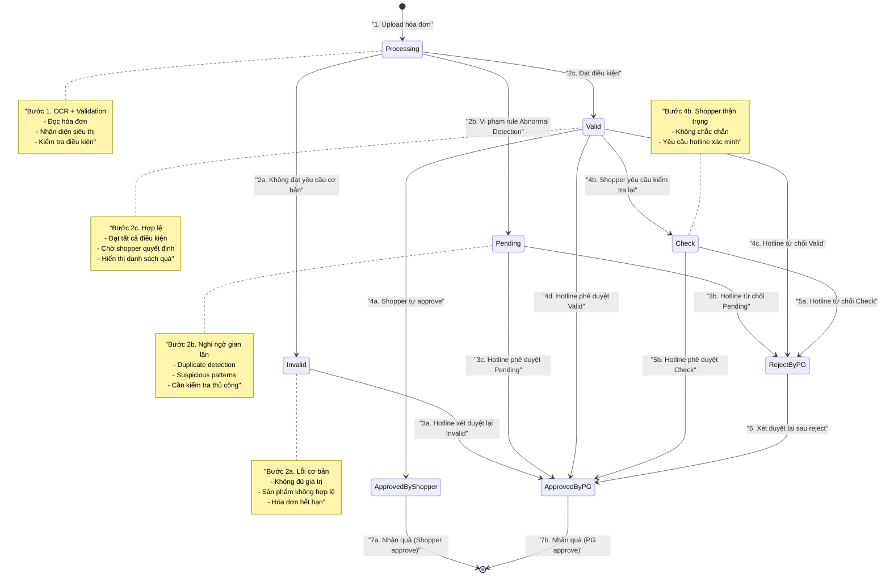

# Lịch sử UHub

**Tác giả:** TriNM - PM của dự án UHub

## Định nghĩa thuật ngữ
- **U**: Công ty Unilever
- **KA**: Key Account - các chuỗi siêu thị là khách hàng của Unilever
  - Ví dụ: Coopmart, Go & Big C, Lotte, Mega, Aeon, Emart
- **CTKM**: Chương Trình Khuyến Mãi (Campaign)
  - **Rule đầu vào** (điều kiện tham gia):
    - Chụp hóa đơn mua hàng đủ điều kiện
    - **Điều kiện mua hàng cụ thể**:
      - Mua giỏ hàng Unilever đạt giá trị xxx VNĐ
      - Mua N số lượng SKU cụ thể
      - Mua giỏ hàng SKU/nhóm sản phẩm đạt giá trị xxx VNĐ
      - Kết hợp điều kiện mua và có SKU cụ thể
    - Nhập code in trên sản phẩm
    - Tham gia hoạt động offline được PG xác nhận
    - Tham gia survey
    - Quan tâm Zalo OA Quà Tặng Unilever
    - Tham gia game trên Uhub
  - **Kết quả đầu ra** (ưu đãi từ chương trình):
    - Tặng quà E-Gift/E-Voucher qua SMS hoặc Zalo ZNS
    - Tặng quà vật lý phát tại cửa hàng qua PG
    - Tặng quà vật lý giao tận nhà (quà nhã qua vòng quay may mắn)
    - Tặng mẫu thử phát tại cửa hàng qua PG
    - Tặng điểm, có thể dùng đổi quà trên kho quà UHub
    - Tặng lượt quay may mắn/vòng quay trúng thưởng
    - Ủng hộ tiền cho quỹ từ thiện
    - Tặng mã code tham dự chương trình quay số
    - Tặng vé tham gia sự kiện
  - **Standard Scheme** (Các dạng campaign chuẩn):
    
    | Loại Campaign | Mô tả | Ví dụ |
    |---|---|---|
    | **Giỏ hàng Unilever + E-Voucher** | Mua giỏ hàng Unilever xxx VNĐ → Nhận 1 e-voucher | Đơn hàng Unilever 599.000 VNĐ → Voucher GotIt 50.000đ |
    | **Giỏ hàng Unilever + Quà vật lý** | Mua giỏ hàng Unilever xxx VNĐ → Nhận quà tại store | Mua giỏ hàng 349K chăm sóc sắc đẹp → 1 mẫu thử |
    | **Giỏ hàng Unilever + Quay may mắn** | Mua giỏ hàng Unilever xxx VNĐ → 1 lượt quay | - |
    | **Giỏ hàng + SKU + Ủng hộ quỹ** | Mua giỏ hàng xxx VNĐ có SKU → Góp tiền quỹ | Đơn 399K có Lifebuoy/Clear → Góp 5K quỹ Chuyến xe hạnh phúc |
    | **Số lượng SKU + E-Voucher** | Mua N số lượng SKU → Nhận 1 e-voucher | Mua 02 gói KNORR 900G → E-Voucher 50K |
    | **Số lượng SKU + Quà vật lý** | Mua N số lượng SKU → Nhận quà tại store | Buy 3 Closeup White Now → 1 gấu đeo chéo Closeup |
    | **Giỏ hàng SKU + E-Voucher** | Mua giỏ hàng SKU xxx VNĐ → Nhận 1 e-voucher | Giỏ hàng 89K P/S và Close Up → Voucher 10K |
    | **Giỏ hàng SKU + Quà vật lý** | Mua giỏ hàng SKU xxx VNĐ → Nhận quà tại store | Mua 299K sản phẩm Giặt Giũ → 1 chai dầu ăn 400ml |
    | **Kết hợp + Quay may mắn** | Mua giỏ hàng SKU + có SKU cụ thể → Quay may mắn | Đơn 599K Unilever có Comfort 3.2L + Sunlight → Vòng quay may mắn |
- **Gift Vendor**: Nhà cung cấp quà E-Gift (GotIt, Urbox) cho Unilever
- **SKU**: Stock Keeping Unit - Mã sản phẩm cụ thể

## Các Actor trong hệ thống

### Người dùng cuối (End Users)

- **Shopper**: Người tiêu dùng mua sản phẩm Unilever
  - Mua hàng tại siêu thị (MT) và các kênh cửa hàng (GT)
  - Tham gia chương trình khuyến mãi để nhận quà qua webapp

- **PG (Promoter Girl)**: Nhân viên khuyến mãi
  - Được Unilever thuê để hỗ trợ khách hàng tại cửa hàng
  - Hướng dẫn tham gia CTKM qua webapp
  - Phát quà mẫu thử và quà vật lý cho khách hàng

### Đội ngũ Unilever

- **RI (Retail Innovation Team)**: Đội ngũ Đổi mới Bán lẻ
  - Xây dựng và triển khai giải pháp công nghệ mới
  - Tối ưu hóa chi phí chạy chương trình khuyến mãi
  - Đơn vị tạo ra UHub

- **BT (Brand Team)**: Các đội ngũ thương hiệu
  - Chạy các chương trình khuyến mãi sử dụng UHub

- **ITU (IT Unilever)**: Đội ngũ IT của Unilever
  - Hỗ trợ các business team (RI, BT)
  - Làm việc với technical vendor
  - Review effort và timeline dự án

### Đội ngũ Utop

- **Utop Admin**: Quản trị viên cấp 2 (L2 Support)
  - Nhận yêu cầu setup CTKM từ Unilever
  - Tư vấn và đánh giá tính khả thi
  - Quyết định có thể setup campaign trên UHub hay không

- **Hotline**: Nhân viên hỗ trợ khách hàng
  - Xét duyệt hóa đơn bị từ chối không chính xác (case by case khi có yêu cầu từ shopper)
  - Thẩm định & Xét duyệt hóa đơn vi phạm quy tắc chống gian lận
  - Hướng dẫn tham gia CTKM và xử lý khiếu nại
  - Hỗ trợ liên hệ trao quà

## Phần 1: Tổng quan về UHub

### Lịch sử dự án
- **Thời gian bắt đầu**: Tháng 05/2020
- **Khách hàng**: Công ty Unilever

### Người dùng chính (2025)
UHub hiện tại phục vụ hai nhóm người dùng chính:
1. **Shopper** (Người tiêu dùng)
2. **PG in store** (Nhân viên khuyến mãi tại cửa hàng)
3. **RI/BT** (Nhân viên Unilever, lập kết hoạch chạy campaign và yêu cầu Utop Admin cài đặt trên hệ thống UHub)
4. **Utop Admin** (Nhân viên Utop, Tư vấn & setup campaign trên Uhub, L2 Support)
5. **Hotline** (Nhân viên Utop, L1 support)
#### 1. Shopper Journey: Chụp hoá đơn, nhận quà

**Bước 1: Truy cập và đăng nhập**
- Shopper mua hàng Unilever tại các Key Account (Coopmart, Big C, ...)
- Truy cập URL của UHub
- Đăng nhập với số điện thoại và SMS OTP
- Cập nhật profile và đồng ý consent

**Bước 2: Các loại chương trình khuyến mãi**
- **Loại 1**: Mua giỏ hàng đạt giá trị xxx VND → Nhận quà E-Gift qua SMS
- **Loại 2**: Mua giỏ hàng đạt giá trị xxx VND → Nhận quà vật lý tại store
- **Điều kiện khác**: 
  - Mua số lượng sản phẩm chỉ định
  - Mua tổng tiền loại sản phẩm chỉ định  
  - Mua sản phẩm thuộc brand A hoặc Brand B
- **tham khảo**
  - CTKM => Standard Scheme

**Bước 3: Chụp và xử lý hóa đơn**
1. **Chụp hóa đơn**: Shopper chụp hóa đơn theo hướng dẫn
2. **Xử lý OCR**: Hệ thống gọi API Azure OCR để lấy dữ liệu text + toạ độ
3. **Nhận diện KA**: Hệ thống đọc Azure JSON để xác định Key Account
4. **Trích xuất thông tin**: Sử dụng dữ liệu training riêng cho từng KA để đọc thông tin hoá đơn
5. **Kiểm tra điều kiện**: So sánh với chương trình khuyến mãi đang hoạt động
6. **Cập nhật quà**: Tính toán danh sách quà dự kiến
7. **Kiểm tra gian lận**: Áp dụng các rule Abnormal Detection

**Bước 4: Kết quả xử lý**

Sau khi hệ thống xử lý hóa đơn, có thể xuất hiện các kết quả sau:

#### A. Trạng thái xử lý

**Thứ tự xử lý tuần tự:**
`Processing → Invalid → Pending → Valid → Check → ApprovedByShopper/RejectByPG/ApprovedByPG`

**Các trạng thái theo thứ tự xử lý:**

1. **Processing (Đang xử lý)**: Hệ thống đang phân tích hóa đơn
   - OCR đọc nội dung hóa đơn
   - Nhận diện Key Account (siêu thị)
   - Trích xuất thông tin sản phẩm và giá trị
   - Kiểm tra điều kiện chương trình khuyến mãi

2. **Invalid (Không hợp lệ)**: Hóa đơn không đạt yêu cầu cơ bản
   - Không nhận diện được siêu thị
   - Giá trị hóa đơn không đủ điều kiện
   - Sản phẩm không thuộc chương trình
   - Hóa đơn đã hết hạn hoặc đã sử dụng
   - **Có thể được xét duyệt lại bởi hotline** → **ApprovedByPG**

3. **Pending (Chờ xét duyệt)**: Hóa đơn vi phạm rule Abnormal Detection
   - Nghi ngờ gian lận (duplicate, suspicious pattern)
   - Cần hotline kiểm tra thủ công chi tiết
   - **Kết quả từ hotline** → **RejectByPG** hoặc **ApprovedByPG**

4. **Valid (Hợp lệ)**: Hóa đơn đạt điều kiện, chờ shopper xác nhận
   - Đã qua tất cả kiểm tra tự động
   - Hiển thị danh sách quà để shopper chọn
   - **Shopper có 3 lựa chọn:**
     - Tự approve → **ApprovedByShopper**
     - Yêu cầu kiểm tra lại → **Check**
     - Không phản hồi → cần gọi hotline hỗ trợ

5. **Check (Yêu cầu kiểm tra lại)**: Shopper không chắc chắn, yêu cầu hotline xác minh
   - Shopper muốn đảm bảo tính chính xác
   - **Kết quả từ hotline** → **RejectByPG** hoặc **ApprovedByPG**

**Trạng thái cuối cùng:**

6. **ApprovedByShopper**: Hóa đơn được shopper tự xác nhận
   - **Trạng thái cuối cùng** - shopper nhận quà ngay lập tức
   - Quà E-Gift: gửi SMS/Zalo ZNS
   - Quà vật lý: tạo QR code để nhận tại store

7. **RejectByPG**: Hóa đơn bị hotline từ chối sau kiểm tra
   - Hotline xác định hóa đơn không hợp lệ
   - **Vẫn có thể được xét duyệt lại** → **ApprovedByPG** (nếu có căn cứ mới)

8. **ApprovedByPG**: Hóa đơn được hotline phê duyệt sau kiểm tra
   - **Trạng thái cuối cùng** - shopper nhận quà
   - Hotline đã xác minh tính hợp lệ của hóa đơn

**Biểu đồ luồng xử lý:**

#### B. Lỗi hệ thống và kỹ thuật
- **SystemError**: Đã xảy ra lỗi hệ thống
- **OCR thất bại**: Không đọc được nội dung hóa đơn
- **ExceptionBill**: Mẫu hóa đơn không được hỗ trợ
- **BlurInvoice**: Hóa đơn bị mờ hoặc che thông tin
- **MaxAngleBill/ReverseBill**: Hóa đơn bị nghiêng, cần chụp lại
- **TwoInvoice**: Hệ thống phát hiện nhiều hóa đơn khác nhau
- **IncorrectImageSequence**: Hình chụp không đúng thứ tự

#### C. Lỗi về thông tin hóa đơn
- **MallNull/StoreNull**: Không nhận diện được tên siêu thị
- **UnsupportedMall/UnsupportedStore**: Siêu thị/cửa hàng không áp dụng chương trình
- **ReceiptIdBillIsNull**: Không đọc được mã hóa đơn
- **BillDateIsEmpty**: Không đọc được ngày hóa đơn
- **BillExist**: Hóa đơn đã tồn tại trên hệ thống
- **ReprintBill/Reprint**: Hóa đơn in lại không được chấp nhận

#### D. Lỗi về điều kiện tham gia
- **NotEnoughAmount**: Giá trị hóa đơn không đủ điều kiện
- **ExpiredDatetime**: Ngày mua hàng không trong thời gian hợp lệ
- **InvalidValidityTime**: Hóa đơn quá <n> ngày kể từ ngày mua hàng
- **MinimumProductCount**: Cần ít nhất 2 sản phẩm Unilever khác loại
- **CampaignNotStart**: Chương trình chưa bắt đầu hoặc đã kết thúc
- **MStoreIsNotSupported**: Hóa đơn không đủ điều kiện tham gia

#### E. Lỗi về giới hạn và gian lận
- **BlackList**: Số điện thoại/thiết bị bị khóa do vi phạm
- **FingerLimit**: Chỉ được dùng 1 số điện thoại cho 1 thiết bị
- **LimitGift**: Đã đạt giới hạn quà/điểm/lượt quay tối đa
- **MaxCapture**: Đã đạt giới hạn số lần chụp
- **MaxTotalAmountU**: Đã đạt giới hạn tổng giá trị
- **MemberCodeInValid**: Hóa đơn thuộc về khách hàng khác
- **BillCodeDuplicate**: Hoá đơn trùng Barcode với 1 hoá đơn khác

#### F. Lỗi về quà tặng và đổi quà
- **StockIsEmpty**: Kho quà đã hết
- **NotEnoughCoin**: Không đủ điểm để đổi quà
- **NotEnoughTurn**: Đã hết lượt quay
- **LuckyDrawNoProduct**: Vòng quay chưa có quà
- **NoVoucherAllocate/UnableAllocateVoucher**: Không thể cấp phát voucher
- **ErrorCallAPIGotIt**: Lỗi khi gọi API nhà cung cấp quà

#### G. Lỗi về mã code và topup
- **CodeNotFound**: Code không hợp lệ
- **CodeIsUsed**: Code đã được sử dụng
- **CodeIsExpiredDate**: Code đã hết hạn
- **LimitTopupByPhone/LimitTopupByUser**: Đã đạt giới hạn nạp tiền
- **TopUpFailed**: Nạp tiền thất bại

#### H. Trường hợp thành công
- **ApprovedByShopper/ApprovedByPG**: Hóa đơn được duyệt
- Hiển thị danh sách quà để shopper xác nhận
- Shopper có thể chấp nhận hoặc yêu cầu hotline kiểm tra lại
- **PgOnly**: Cần liên hệ nhân viên Unilever để đổi quà

**Bước 5: Nhận quà**
- **Quà E-Gift**: Gọi API Gift Vendor để phát quà
- **Quà vật lý**: Tạo order nhận quà tại store (chờ PG xác nhận)
- Thông tin quà được lưu trong mục "Quà của tôi"

**Các chức năng khác:**
- Xem quà của tôi
- Đọc thể lệ chương trình
#### 2. PG Journey: Đăng nhập, chọn campaign, scan qr trên thiết bị của shopper, phát quà

PG là các cá nhân được Unilever thuê để hỗ trợ shopper tại cửa hàng.

**A. Quy trình trao quà vật lý**

*Điều kiện đầu vào:*
- Shopper đã hoàn tất bước chụp hóa đơn
- Có thông tin quà vật lý trong mục "Quà của tôi"

*Các bước thực hiện:*
1. **Truy cập PG App**: PG đăng nhập bằng user/password đã được phân quyền
2. **Chọn campaign**: Lựa chọn chương trình cần trao quà (đã được phân quyền)
3. **Quét QR**: Scan mã QR nhận quà của shopper
   - Shopper vào: Quà của tôi → Chọn quà → Chi tiết quà
4. **Xác nhận**: PG xác nhận trao quà trên PG App
5. **Trao quà**: Trao quà vật lý cho shopper

**B. Quy trình phát mẫu thử (Sampling)**

*Điều kiện đầu vào:*
- Shopper có tài khoản UHub (đã đăng nhập ít nhất 1 lần)
- PG có quyền truy cập campaign sampling đang hoạt động
- Có sẵn stock mẫu thử tại cửa hàng

*Các bước thực hiện:*
1. **Truy cập PG App**: PG đăng nhập bằng user/password đã được phân quyền
2. **Chọn campaign**: Lựa chọn chương trình sampling cần phát (đã được phân quyền)
3. **Hướng dẫn shopper**: PG yêu cầu shopper:
   - Truy cập trang UHub
   - Đăng nhập tài khoản (số điện thoại + SMS OTP)
   - Chọn "QR của tôi" để hiển thị mã QR cá nhân
4. **Quét QR**: PG scan mã QR cá nhân của shopper từ màn hình điện thoại
5. **Chọn loại mẫu**: PG chọn loại mẫu sampling phù hợp
   - Mỗi campaign có thể có nhiều loại mẫu thử khác nhau
   - Hệ thống hiển thị danh sách mẫu available
6. **Xác nhận**: PG xác nhận phát mẫu thử trên PG App
7. **Trao mẫu**: Trao mẫu thử vật lý cho shopper
