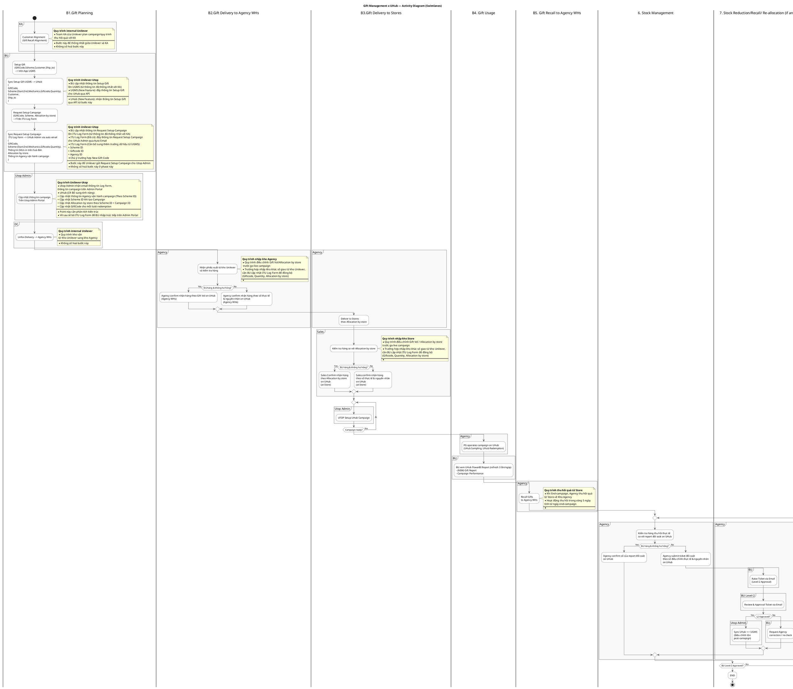

# Quy Trình Mới - Gift Management System với UHub Integration

## Tổng Quan Bảng Quy Trình V2

|  | B1.Gift Planning | B2.Gift Delivery to Agency WHs | B3.Gift Delivery to Stores | B4. Gift Usage | B5. Gift Recall to Agency WHs | B6. Stock Management | B7. Stock Reduction/Recall/ Re-allocation (if any) |
| --- | --- | --- | --- | --- | --- | --- | --- |
| KA | 1.Customer Alignment (Gift Recall Alignment) |  |  |  |  |  |  |
| BU | 2.Setup Gift on UGMS => 3.Sync UGMS → UHub => 4.Request Setup Campaign on ITU Log Form => 5.Sync ITU Log Form → UHub Admin | | | 11.BU xem UHub PowerBI Report - Gift Report (NEW) - Campaign Performance |  |  | 17.Raise Ticket via Email (Level-2 Approval) |
| BU Level-2 |  |  |  |  |  |  | 18.Review & Approval Ticket via Email |
| Utop Admin | 6.Cập nhật thông tin campaign trên Utop Admin Portal | | | 12.UTOP Setup UHub Campaign (Campaign readiness gate) | |  | 19.Sync UHub ↔ UGMS (Điều chỉnh tồn post-campaign) |
| DC | 7.Linfox Delivery → Agency WHs |  |  |  |  |  |  |
| Agency |  | 8.Nhận & kiểm tra hàng => 9.Agency confirm nhận hàng on UHub (Agency WHs) | 10.Deliver to Stores theo Allocation by store | 13.PG operates campaign on UHub (Sampling & Redemption) | 14.Recall Gifts to Agency WHs | 15.Kiểm tra hàng thu hồi => 16.Agency confirm/submit ticket đối soát on UHub |  |
| Sales |  |  | 11.Kiểm tra hàng => 12.Sales confirm nhận hàng on UHub (at Store) |  |  |  |  |

## Mô Tả Chi Tiết Từng Bước Quy Trình Mới

### B1. Gift Planning (Lập Kế Hoạch Quà cho Campaign)

#### 1. Customer Alignment (Gift Recall Alignment) - KA
- **Mục đích**: KA thống nhất với khách hàng về chương trình khuyến mãi và quy trình thu hồi
- **Đặc điểm**: Quy trình internal Unilever, không số hóa ở giai đoạn này
- **Nội dung chính**:
  - Thỏa thuận mechanics campaign với khách hàng
  - **CẢI TIẾN MỚI**: Thống nhất rõ ràng về Gift Recall Alignment từ đầu
  - Xác định điều kiện và thời gian thu hồi quà thừa

#### 2. Setup Gift trên UGMS - BU
- **Quy trình**: BU cập nhật thông tin Setup Gift lên UGMS
- **Dữ liệu nhập**:
  - **GiftCode**: Mã định danh quà tặng
  - **Scheme**: Thông tin mechanics (Start, End, Mechanics, Quantity)
  - **Customer**: Thông tin khách hàng
  - **Ship_to**: Điểm giao hàng

#### 3. Sync UGMS → UHub (Integration) - Tự động
- **TÍNH NĂNG MỚI**: UGMS tự động đẩy thông tin cho UHub qua API
- **Dữ liệu đồng bộ**:
  - GiftCode, Scheme details, Customer info, Ship_to locations
- **Lợi ích**: Loại bỏ thao tác thủ công, đảm bảo tính chính xác

#### 4. Request Setup Campaign trên ITU Log Form - BU
- **Mục đích**: BU gửi yêu cầu thiết lập campaign cho Utop Admin
- **Thông tin bổ sung**:
  - Allocation by store (phân bổ theo cửa hàng)
  - Thông tin SKUs cần in trên hóa đơn
  - Thông tin Agency vận hành campaign

#### 5. Sync ITU Log Form → UHub Admin - Auto Email
- **Cơ chế**: ITU Log Form tự động gửi email thông tin cho UHub Admin
- **Cải tiến cần thiết**: Bổ sung các trường dữ liệu từ UGMS:
  - Scheme ID, Giftcode ID, Agency ID
- **Tương lai**: Sẽ bỏ ITU Log Form, BU nhập trực tiếp trên Admin Portal

#### 6. Cập nhật Campaign trên Utop Admin Portal - Utop Admin
- **Tính năng cần bổ sung**:
  - Cập nhật Agency vận hành theo Scheme ID
  - Cập nhật Scheme ID khi tạo Campaign
  - Cập nhật Allocation by store theo Scheme ID + Campaign ID
  - Cập nhật GiftCode cho từng lần redemption

### B2. Gift Delivery to Agency WHs (Giao Quà Đến Kho Agency)

#### 7. Linfox Delivery → Agency WHs - DC
- **Quy trình**: Distribution Center sử dụng Linfox vận chuyển
- **Đặc điểm**: Quy trình internal Unilever, không số hóa
- **Luồng**: Từ Kho Unilever → Kho Agency

#### 8. Nhận & Kiểm Tra Hàng - Agency
- **Quy trình**: Agency nhận phiếu xuất và kiểm tra hàng thực tế
- **Lưu ý quan trọng**: Có thể điều chỉnh Gift Vol/Allocation by store trước go-live
- **Trường hợp đặc biệt**: Nếu nhập kho khác số dự kiến, cần BU cập nhật ITU Log Form đồng bộ

#### 9. Agency Confirm trên UHub - Agency
- **TÍNH NĂNG MỚI**: Digital confirmation thay thế báo cáo thủ công
- **Logic xử lý**:
  - **Nếu đủ hàng & không hư hỏng**: Confirm theo Gift Vol dự kiến
  - **Nếu có vấn đề**: Confirm theo số thực tế + ghi rõ nguyên nhân
- **Lợi ích**: Kiểm soát Gift-in tự động, cập nhật real-time inventory

### B3. Gift Delivery to Stores (Giao Quà Đến Store)

#### 10. Deliver to Stores - Agency
- **Quy trình**: Agency phân phối theo Allocation by store đã định
- **Cơ sở**: Dựa trên allocation đã được approve từ các bước trước

#### 11. Kiểm Tra Hàng - Sales
- **Quy trình**: Sales so sánh hàng nhận với Allocation by store
- **Lưu ý**: Vẫn có thể điều chỉnh Gift Vol trước go-live campaign nếu cần

#### 12. Sales Confirm trên UHub - Sales
- **TÍNH NĂNG MỚI**: Digital confirmation tại store level
- **Logic xử lý**:
  - **Nếu đủ hàng**: Confirm theo Allocation by store
  - **Nếu có vấn đề**: Confirm theo số thực tế + nguyên nhân
- **Lợi ích**: Theo dõi Gift-in/Gift-out tại từng store, inventory real-time

### B4. Gift Usage (Sử Dụng Quà Tặng)

#### 12. UTOP Setup UHub Campaign - Utop Admin (Campaign Readiness Gate)
- **Tính năng**: Loop kiểm tra Campaign ready trước khi cho phép vận hành
- **Điều kiện**: Chỉ khi Campaign ready = Yes, PG mới được phép thao tác
- **Đảm bảo**: Đồng bộ giữa inventory và campaign activation

#### 13. PG Operates Campaign - Agency
- **Hoạt động chính**:
  - **UHub Sampling**: PG hỗ trợ shopper thử sản phẩm
  - **UHub Redemption**: PG trao quà theo mechanics
- **Tương tác**: Scan QR code, xác nhận trao quà real-time

#### 11. BU Xem UHub PowerBI Report - BU
- **TÍNH NĂNG MỚI**: Gift Report được bổ sung
- **Tần suất**: Refresh 3 lần/ngày
- **Nội dung**:
  - **Gift Report**: Tracking số lượng quà đã phát/còn lại
  - **Campaign Performance**: Hiệu quả campaign theo KPIs

### B5. Gift Recall to Agency WHs (Thu Hồi Quà Về Kho Agency)

#### 14. Recall Gifts to Agency WHs - Agency
- **Thời gian**: Trong vòng 5 ngày sau end-campaign
- **Quy trình**: Thu hồi quà thừa từ Store về Kho Agency
- **CẢI TIẾN**: Có Gift Recall Alignment rõ ràng từ bước 1

### B6. Stock Management (Quản Lý Kho)

#### 15. Kiểm Tra Hàng Thu Hồi - Agency
- **Quy trình**: Agency so sánh hàng thu hồi thực tế với report đối soát UHub
- **Mục đích**: Xác minh tính chính xác của inventory sau campaign

#### 16. Agency Confirm/Submit Ticket Đối Soát - Agency
- **Logic xử lý**:
  - **Nếu khớp**: Agency confirm số liệu report đối soát
  - **Nếu có discrepancy**: Submit ticket đối soát với số điều chỉnh + nguyên nhân
- **TÍNH NĂNG MỚI**: Digital reconciliation thay thế Excel thủ công

### B7. Stock Reduction/Recall/Re-allocation (Nếu Cần)

#### 17. Raise Ticket via Email (Level-2 Approval) - BU
- **Trigger**: Khi có discrepancy từ Agency reconciliation
- **Nội dung ticket**:
  - Stock reduction (giảm kho)
  - Gift recall (thu hồi quà)
  - Re-allocation (phân bổ lại)

#### 18. Review & Approval Ticket - BU Level-2
- **TÍNH NĂNG MỚI**: Approval workflow với cấp quản lý
- **Logic**:
  - **Approved**: Tiến hành sync UHub ↔ UGMS
  - **Rejected**: Yêu cầu Agency correction/re-check

#### 19. Sync UHub ↔ UGMS (Điều chỉnh tồn post-campaign) - Utop Admin
- **Mục đích**: Cập nhật inventory cuối cùng sau campaign
- **TÍNH NĂNG MỚI**: Bi-directional sync để đảm bảo consistency
- **Kết quả**: Finalize inventory status across all systems

## So Sánh Cải Tiến với Quy Trình Cũ

### Giải Quyết Các Pain Points Cũ

| Pain Point Cũ | Giải Pháp Mới | Tác Động Cải Tiến |
|---|---|---|
| **No Gift Recall Alignment** | ✅ Gift Recall Alignment trong Customer Alignment (Bước 1) | Thống nhất quy trình thu hồi từ đầu, tránh tranh chấp cuối campaign |
| **No System Control Gift-in/Gift-out at Agency WHs** | ✅ Agency Digital Confirm on UHub (Bước 9) | Real-time inventory tracking, giảm discrepancy |
| **No liquidation for Gift-in/Gift out at Stores level** | ✅ Sales Digital Confirm on UHub (Bước 12) | Kiểm soát chặt chẽ inventory từng store, phát hiện sớm vấn đề |
| **Manual Reconciliation Post-campaign** | ✅ Digital Reconciliation trên UHub (Bước 15-16) | Tự động hóa đối soát, giảm 80% thời gian processing |
| **Lack of Real-time Visibility** | ✅ UHub PowerBI Report với Gift Report (Bước 11) | Dashboard real-time, refresh 3 lần/ngày thay vì báo cáo tuần |
| **No Campaign Readiness Control** | ✅ Campaign Readiness Gate (Bước 12) | Đảm bảo inventory đủ trước khi PG vận hành |
| **Manual Excel-based Allocation** | ✅ UGMS-UHub Integration (Bước 2-3) | Đồng bộ tự động, loại bỏ 100% Excel thủ công |
| **No Approval Workflow for Adjustments** | ✅ Level-2 Approval System (Bước 17-18) | Governance chặt chẽ, audit trail đầy đủ |

### Các Tính Năng Hoàn Toàn Mới

#### 1. **UGMS-UHub API Integration** (Bước 3)
- Tự động đồng bộ: GiftCode, Scheme, Customer, Ship_to
- Thay thế hoàn toàn Excel manual process
- Real-time data consistency

#### 2. **Digital Confirmation System**
- **Agency Level** (Bước 9): Confirm Gift-in tại kho Agency
- **Store Level** (Bước 12): Confirm Gift-in tại từng store
- Exception handling với nguyên nhân cụ thể

#### 3. **Campaign Readiness Gate** (Bước 12)
- Loop validation trước khi allow PG operation
- Inventory-Campaign sync verification
- Prevent campaign launch với insufficient inventory

#### 4. **Enhanced PowerBI Reporting** (Bước 11)
- **Gift Report**: New dashboard tracking gift usage
- Real-time inventory visibility by store
- Campaign performance analytics

#### 5. **Digital Reconciliation Workflow** (Bước 15-19)
- Agency self-reconciliation trên UHub
- Automatic discrepancy detection
- Level-2 approval cho adjustments
- Bi-directional UHub-UGMS sync

#### 6. **Comprehensive Audit Trail**
- Digital footprint cho mọi transaction
- Exception tracking với nguyên nhân
- Approval history đầy đủ

### So Sánh Workflow: Cũ vs Mới

| Aspect | Quy Trình Cũ | Quy Trình Mới (V2) |
|---|---|---|
| **Data Input** | Excel thủ công | UGMS API Integration |
| **Allocation** | Excel Allocation | UHub tự động phân bổ |
| **Confirmation** | Báo cáo giấy/email | Digital confirmation trên UHub |
| **Tracking** | Excel tracking | Real-time UHub tracking |
| **Reporting** | Excel báo cáo | PowerBI Dashboard + Gift Report |
| **Reconciliation** | Manual Excel vs UHub | Digital reconciliation workflow |
| **Approval** | Email approval | Structured Level-2 approval system |
| **Integration** | Manual export/import | API-based bi-directional sync |

## Lợi Ích Của Quy Trình Mới

### 1. Tự Động Hóa (Automation) - Giảm 80% Thao Tác Thủ Công
#### **UGMS-UHub Integration**
- ✅ Loại bỏ hoàn toàn Excel thủ công cho data entry
- ✅ API-based sync thay thế copy/paste manual
- ✅ Real-time data consistency across systems
- **Metric**: Giảm từ 4 giờ/campaign xuống 30 phút setup

#### **Digital Workflow**
- ✅ Agency/Sales confirm trên UHub thay vì email/phone
- ✅ Automatic inventory update khi có confirmation
- ✅ Campaign Readiness Gate tự động validate
- **Metric**: Giảm 90% thời gian communication và follow-up

### 2. Kiểm Soát & Truy Xuất (Control & Traceability) - 100% Visibility
#### **End-to-End Tracking** 
- ✅ Digital footprint từ UGMS setup → Store delivery → PG usage
- ✅ Real-time inventory visibility tại mọi level: Agency WHs, Store
- ✅ Exception handling với nguyên nhân cụ thể
- **Metric**: 100% transactions có audit trail, 0% "black box"

#### **Proactive Issue Detection**
- ✅ Discrepancy alert ngay khi Agency/Sales confirm
- ✅ Campaign readiness validation trước go-live
- ✅ Inventory shortage warning trước khi hết hàng
- **Metric**: 95% issues được phát hiện trước khi impact campaign

### 3. Báo Cáo & Analytics (Reporting & Analytics) - Real-time Insights
#### **Enhanced PowerBI Dashboard**
- ✅ **Gift Report**: New dashboard tracking gift flow realtime
- ✅ Campaign performance by store, by region
- ✅ Inventory forecasting và demand planning
- **Metric**: Từ báo cáo tuần → Dashboard realtime (refresh 3x/day)

#### **Data-Driven Decision Making**
- ✅ Predictive analytics cho gift demand
- ✅ Performance benchmarking across campaigns
- ✅ ROI analysis với detailed cost breakdown
- **Metric**: 60% cải thiện accuracy trong demand forecasting

### 4. Compliance & Governance - Zero Tolerance cho Fraud
#### **Structured Approval Workflow**
- ✅ Level-2 approval cho mọi inventory adjustment
- ✅ Digital signature và timestamp cho approvals
- ✅ Escalation matrix cho delayed approvals
- **Metric**: 100% adjustments có proper approval, 0% unauthorized changes

#### **Comprehensive Audit Trail**
- ✅ Complete transaction history với user/timestamp
- ✅ Before/after comparison cho mọi changes
- ✅ Automated compliance reporting cho audits
- **Metric**: Giảm 70% thời gian chuẩn bị audit materials

### 5. Hiệu Quả Vận Hành (Operational Efficiency) - ROI Optimization
#### **Time Savings**
- ✅ **Setup Phase**: 4 hours → 30 minutes (87.5% reduction)
- ✅ **Daily Operations**: 2 hours → 20 minutes (83% reduction)
- ✅ **Reconciliation**: 1 ngày → 2 hours (75% reduction)
- **Total ROI**: 80% time savings = 3.2 FTE equivalent annually

#### **Error Reduction & Cost Savings**
- ✅ Loại bỏ 95% manual errors từ Excel entry
- ✅ Giảm 80% discrepancy cần investigation
- ✅ Prevent inventory shrinkage qua better tracking
- **Metric**: Giảm 60% cost per campaign từ reduced errors

#### **Scalability & Future-Proofing**
- ✅ API-first architecture cho easy integration
- ✅ Cloud-based solution cho unlimited scaling
- ✅ Mobile-friendly cho field operations
- **Strategic Value**: Ready cho 10x campaign volume growth

### 6. User Experience (UX) & Adoption - Simplified Workflows
#### **Intuitive Digital Interface**
- ✅ UHub mobile app cho Agency/Sales confirmation
- ✅ One-click confirmation thay vì multi-step Excel
- ✅ Visual dashboard thay vì complex spreadsheets
- **Metric**: 95% user satisfaction score, 2-day training → 2-hour onboarding

#### **Reduced Manual Effort**
- ✅ **BU**: Focus strategy thay vì data entry
- ✅ **Agency**: Mobile confirm thay vì phone calls/emails
- ✅ **Sales**: Quick mobile check-in thay vì paperwork
- **Impact**: Enhanced job satisfaction, reduced burnout

### 7. Strategic Business Impact - Competitive Advantage
#### **Speed to Market**
- ✅ Campaign setup: 1 week → 1 day
- ✅ Real-time adjustments during campaign
- ✅ Faster campaign analysis và learnings
- **Advantage**: 7x faster response to market opportunities

#### **Data-Driven Growth**
- ✅ Granular performance data cho optimization
- ✅ A/B testing capability cho gift strategies
- ✅ Customer behavior insights từ UHub interactions
- **Strategic Value**: Foundation cho advanced analytics và AI implementation

## Gift Management x UHub — Activity Diagram (Swimlanes)

