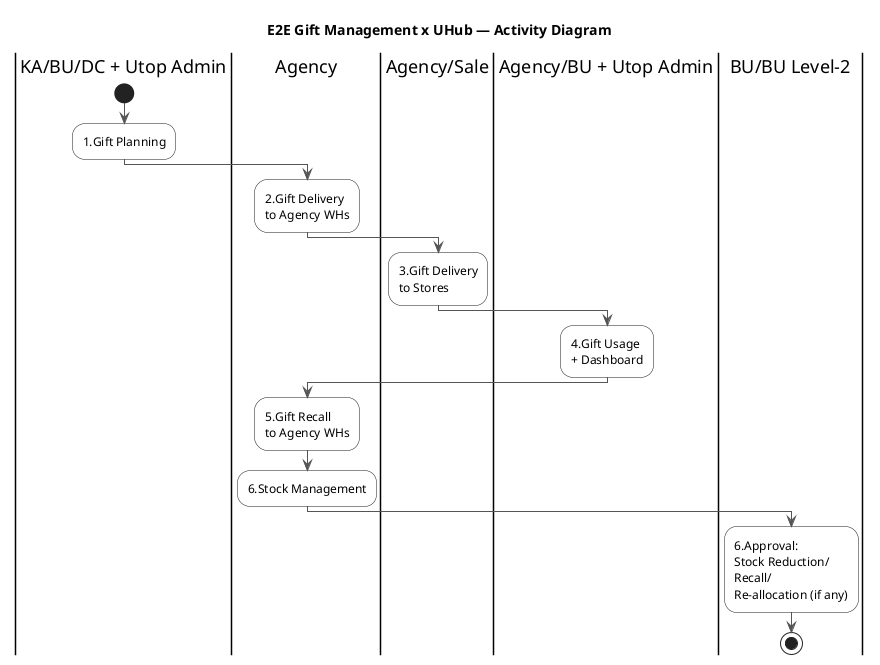
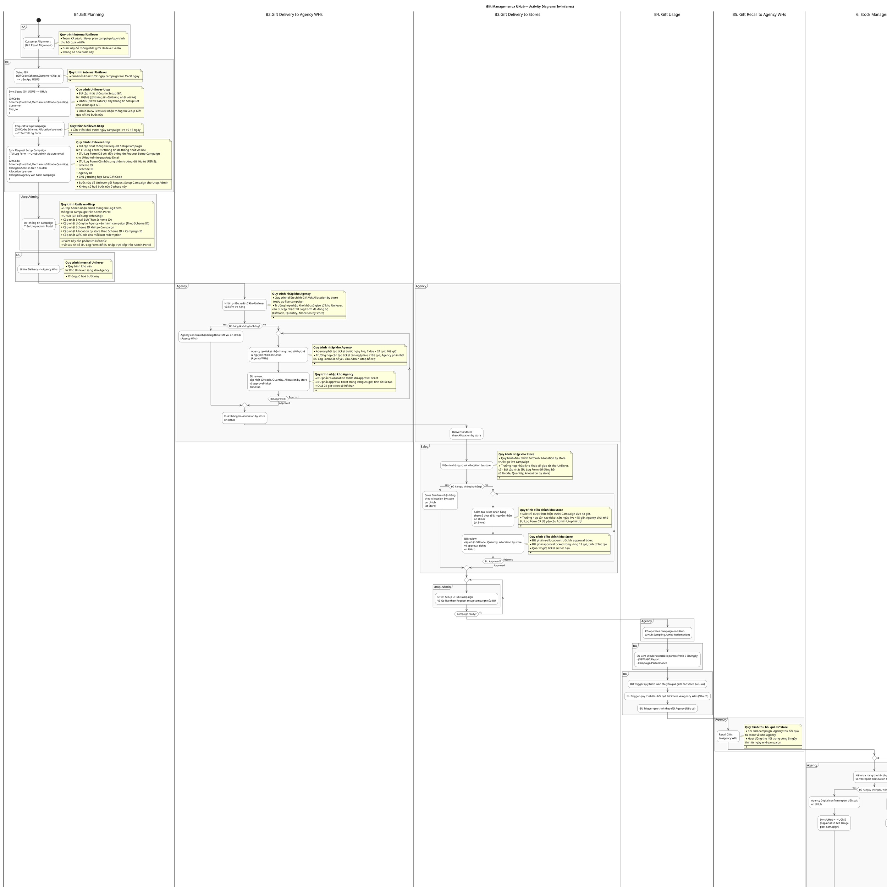

# Quy Trình Mới - Gift Management System với UHub Integration

## Tổng Quan Bảng Quy Trình V2

|  | B1.Gift Planning | B2.Gift Delivery to Agency WHs | B3.Gift Delivery to Stores | B4. Gift Usage | B5. Gift Recall to Agency WHs | B6. Stock Management | B7. Stock Reduction/Recall/ Re-allocation (if any) |
| --- | --- | --- | --- | --- | --- | --- | --- |
| KA | 1.Customer Alignment (Gift Recall Alignment) |  |  |  |  |  |  |
| BU | 2.Setup Gift on UGMS 3.Sync UGMS → UHub 4.Request Setup Campaign on ITU Log Form 5.Sync ITU Log Form → UHub Admin | **6.BU Review & Approval Tickets** - Agency tickets (≤168h before live) - Sales tickets (≤48h before live) - 24h/12h approval SLA | | 11.BU xem UHub PowerBI Report - Gift Report (NEW) - Campaign Performance + 12.**BU Trigger Operations** - Gift transfer between stores - Agency changes |  |  | 17.**BU Raise & Forward Ticket** via Email (Level-2 Approval) + UHub auto email alerts |
| BU Level-2 |  |  |  |  |  |  | 18.Review & Approval Ticket via Email **(NEW: Approval with evidences)** |
| Utop Admin | 6.Cập nhật thông tin campaign trên Utop Admin Portal + **Email BU theo Scheme ID** | | | 12.**UTOP Setup & Go-live Campaign** **LOOP until Campaign ready = Yes** (Campaign readiness gate) theo Request của BU | |  | 19.**Utop Admin Confirm Ticket** Sync UHub ↔ UGMS (Điều chỉnh tồn + evidences) |
| DC | 7.Linfox Delivery → Agency WHs |  |  |  |  |  |  |
| Agency |  | 8.Nhận & kiểm tra hàng **9.Agency Ticket System** - Confirm theo Gift Vol (normal) - Tạo ticket số thực tế + nguyên nhân Xuất Allocation by store | 10.Deliver to Stores theo Allocation by store | 13.PG operates campaign on UHub (Sampling & Redemption) | 14.Recall Gifts to Agency WHs (5 ngày sau end-campaign) | 15.Kiểm tra hàng thu hồi 16.**Agency Reconciliation** - Digital Confirm report đối soát (normal) => Sync UHub ↔ UGMS​ - Submit ticket discrepancy |  |
| Sales |  |  | 11.Kiểm tra hàng **12.Sales Ticket System** - Confirm theo Allocation (normal) - Tạo ticket số thực tế + nguyên nhân |  |  |  |  |

## Flow Tổng Quan Bảng Quy Trình

## Mô Tả Chi Tiết Từng Bước Quy Trình Mới

### B1. Gift Planning (Lập Kế Hoạch Quà cho Campaign)

#### 1. Customer Alignment (Gift Recall Alignment) - KA
- **Mục đích**: KA thống nhất với khách hàng về chương trình khuyến mãi và quy trình thu hồi
- **Đặc điểm**: Quy trình internal Unilever, không số hóa ở giai đoạn này
- **Nội dung chính**:
  - Thỏa thuận mechanics campaign với khách hàng
  - **CẢI TIẾN MỚI**: Thống nhất rõ ràng về Gift Recall Alignment từ đầu
  - Xác định điều kiện và thời gian thu hồi quà thừa

#### 2. Setup Gift trên UGMS - BU
- **Quy trình**: BU cập nhật thông tin Setup Gift lên UGMS
- **Dữ liệu nhập**:
  - **GiftCode**: Mã định danh quà tặng
  - **Scheme**: Thông tin mechanics (Start, End, Mechanics, Quantity)
  - **Customer**: Thông tin khách hàng
  - **Ship_to**: Điểm giao hàng

#### 3. Sync UGMS → UHub (Integration) - Tự động
- **TÍNH NĂNG MỚI**: UGMS tự động đẩy thông tin cho UHub qua API
- **Dữ liệu đồng bộ**:
  - GiftCode, Scheme details, Customer info, Ship_to locations
- **Lợi ích**: Loại bỏ thao tác thủ công, đảm bảo tính chính xác

#### 4. Request Setup Campaign trên ITU Log Form - BU
- **Mục đích**: BU gửi yêu cầu thiết lập campaign cho Utop Admin
- **Thông tin bổ sung**:
  - Allocation by store (phân bổ theo cửa hàng)
  - Thông tin SKUs in trên hóa đơn của KA
  - Thông tin Agency vận hành campaign

#### 5. Sync ITU Log Form → UHub Admin - Auto Email
- **Cơ chế**: ITU Log Form tự động gửi email thông tin cho UHub Admin
- **Cải tiến cần thiết**: Bổ sung các trường dữ liệu từ UGMS:
  - Scheme ID, Giftcode ID, Agency ID
- **Tương lai**: Sẽ bỏ ITU Log Form, BU nhập trực tiếp trên Admin Portal

#### 6. Cập nhật Campaign trên Utop Admin Portal - Utop Admin
- **Tính năng cần bổ sung**:
  - Cập nhật Agency vận hành theo Scheme ID
  - Cập nhật Scheme ID khi tạo Campaign
  - Cập nhật Allocation by store theo Scheme ID + Campaign ID
  - Cập nhật GiftCode cho từng lần redemption

### B2. Gift Delivery to Agency WHs (Giao Quà Đến Kho Agency)

#### 7. Linfox Delivery → Agency WHs - DC
- **Quy trình**: Distribution Center sử dụng Linfox vận chuyển
- **Đặc điểm**: Quy trình internal Unilever, không số hóa
- **Luồng**: Từ Kho Unilever → Kho Agency

#### 8. Nhận & Kiểm Tra Hàng - Agency
- **Quy trình**: Agency nhận phiếu xuất và kiểm tra hàng thực tế
- **Lưu ý quan trọng**: Có thể điều chỉnh Gift Vol/Allocation by store trước go-live
- **Trường hợp đặc biệt**: Nếu nhập kho khác số dự kiến, cần BU cập nhật ITU Log Form đồng bộ

#### 9. Agency Ticket System trên UHub - Agency
- **TÍNH NĂNG MỚI ENHANCED**: Digital confirmation + Ticket workflow với SLA
- **Logic xử lý**:
  - **Nếu đủ hàng & không hư hỏng**: Confirm theo Gift Vol dự kiến
  - **Nếu có vấn đề**: Tạo ticket với số thực tế + nguyên nhân chi tiết
- **Ticket SLA & Timing**:
  - **Deadline**: Agency phải tạo ticket trước 168 giờ (7 ngày) so với ngày go-live
  - **Escalation**: Nếu cận ngày live <168h, Agency nhờ BU Log Form CR hỗ trợ
  - **BU Response SLA**: BU phải approval trong vòng 24 giờ
  - **Auto Expiry**: Ticket hết hạn nếu quá 24 giờ
- **Workflow Loop**: Ticket bị Rejected sẽ lặp lại cho đến khi Approved
- **Final Output**: Xuất thông tin Allocation by store trên UHub sau khi hoàn tất

### B3. Gift Delivery to Stores (Giao Quà Đến Store)

#### 10. Deliver to Stores - Agency
- **Quy trình**: Agency phân phối theo Allocation by store đã định
- **Cơ sở**: Dựa trên allocation đã được approve từ các bước trước

#### 11. Kiểm Tra Hàng - Sales
- **Quy trình**: Sales so sánh hàng nhận với Allocation by store
- **Lưu ý**: Vẫn có thể điều chỉnh Gift Vol trước go-live campaign nếu cần

#### 12. Sales Ticket System trên UHub - Sales
- **TÍNH NĂNG MỚI ENHANCED**: Digital confirmation + Ticket workflow với shorter SLA
- **Logic xử lý**:
  - **Nếu đủ hàng**: Confirm theo Allocation by store
  - **Nếu có vấn đề**: Tạo ticket với số thực tế + nguyên nhân chi tiết
- **Ticket SLA & Timing (Stricter than Agency)**:
  - **Deadline**: Sales chỉ được tạo ticket trước 48 giờ so với Campaign Live
  - **Escalation**: Nếu cận ngày live <48h, Agency phải nhờ BU Log Form CR hỗ trợ
  - **BU Response SLA**: BU phải approval trong vòng 12 giờ (nhanh hơn Agency)
  - **Auto Expiry**: Ticket hết hạn nếu quá 12 giờ
- **Workflow Loop**: Ticket bị Rejected sẽ lặp lại cho đến khi Approved
- **Strategic Rationale**: SLA ngắn hơn ở store level vì gần ngày go-live hơn

### B4. Gift Usage (Sử Dụng Quà Tặng)

#### 12. UTOP Setup UHub Campaign - Utop Admin (Campaign Readiness Gate)
- **TÍNH NĂNG MỚI ENHANCED**: **LOOP kiểm tra Campaign ready = Yes** trước khi cho phép vận hành
- **Quy trình**: Repeat loop "Campaign ready?" until = Yes
- **Điều kiện**: Chỉ khi Campaign ready = Yes, PG mới được phép thao tác
- **Đảm bảo**: Đồng bộ giữa inventory và campaign activation
- **Logic**: Blocking gate để đảm bảo campaign setup hoàn chỉnh

#### 11. BU PowerBI Report + Trigger Operations - BU
- **TÍNH NĂNG MỚI**: Gift Report được bổ sung + Operational triggers
- **Tần suất**: Refresh 3 lần/ngày
- **Nội dung Dashboard**:
  - **Gift Report**: Tracking số lượng quà đã phát/còn lại
  - **Campaign Performance**: Hiệu quả campaign theo KPIs
- **Parallel Process**: Chạy song song với PG campaign operations

#### 12. BU Trigger Operations - BU (TÍNH NĂNG HOÀN TOÀN MỚI)
- **Gift Transfer Between Stores**: BU trigger quy trình luân chuyển quà giữa các Store
  - Dựa trên performance data từ PowerBI Report
  - Điều chỉnh allocation để tối ưu hiệu quả
- **Agency Change Process**: BU trigger quy trình thay đổi Agency nếu cần
  - Dựa trên performance hoặc business requirements
  - Quản lý transfer inventory và campaign responsibility
- **Parallel Process**: Chạy song song với PG campaign operations

#### 13. PG Operates Campaign - Agency
- **Hoạt động chính**:
  - **UHub Sampling**: PG hỗ trợ shopper thử sản phẩm
  - **UHub Redemption**: PG trao quà theo mechanics
- **Tương tác**: Scan QR code, xác nhận trao quà real-time
- **Parallel Process**: Chạy song song với BU monitoring & trigger operations

### B5. Gift Recall to Agency WHs (Thu Hồi Quà Về Kho Agency)

#### 14. Recall Gifts to Agency WHs - Agency
- **Thời gian**: Trong vòng 5 ngày sau end-campaign
- **Quy trình**: Thu hồi quà thừa từ Store về Kho Agency
- **CẢI TIẾN**: Có Gift Recall Alignment rõ ràng từ bước 1

### B6. Stock Management (Quản Lý Kho)

#### 15. Kiểm Tra Hàng Thu Hồi - Agency
- **Quy trình**: Agency so sánh hàng thu hồi thực tế với report đối soát UHub
- **Mục đích**: Xác minh tính chính xác của inventory sau campaign

#### 16. Agency Reconciliation System - Agency
- **TÍNH NĂNG MỚI ENHANCED**: **LOOP kiểm tra reconciliation** cho đến khi approved
- **Logic xử lý Enhanced**:
  - **Nếu khớp**: Agency digital confirm số liệu report đối soát → Tự động Sync UHub ↔ UGMS
  - **Nếu có discrepancy**: Submit ticket đối soát với số điều chỉnh + nguyên nhân
- **Workflow Loop**: Repeat "BU Level-2 Approved?" until = Approved (not Rejected)
- **TÍNH NĂNG MỚI ENHANCED**: 
  - Digital reconciliation thay thế Excel thủ công
  - **Auto Email Alert**: UHub gửi auto email thông tin ticket cho BU
  - **Automatic Sync**: Nếu khớp, tự động cập nhật số Gift Usage post-campaign

### B7. Stock Reduction/Recall/Re-allocation (Nếu Cần)

#### 17. BU Raise & Forward Ticket (Level-2 Approval) - BU
- **Trigger**: Khi có discrepancy từ Agency reconciliation + UHub auto email alert
- **Enhanced Process**: BU Raise & Forward thay vì chỉ Raise
- **Nội dung ticket**:
  - Stock reduction (giảm kho)
  - Gift recall (thu hồi quà) 
  - Re-allocation (phân bổ lại)
- **Workflow Enhancement**: BU forward ticket lên Level-2 với context đầy đủ

#### 18. Review & Approval Ticket - BU Level-2
- **TÍNH NĂNG MỚI**: Approval workflow với cấp quản lý
- **Logic**:
  - **Approved**: Tiến hành sync UHub ↔ UGMS
  - **Rejected**: Yêu cầu Agency correction/re-check

#### 19. Utop Admin Confirm Ticket + Enhanced Sync - Utop Admin
- **Enhanced Process**: 2-step process với evidence tracking
  - **Step 1**: Utop Admin confirm ticket (audit trail)
  - **Step 2**: Sync UHub ↔ UGMS với evidences của BU Level-2 Approval
- **Mục đích**: Cập nhật inventory cuối cùng sau campaign với full traceability
- **TÍNH NĂNG MỚI ENHANCED**: 
  - Bi-directional sync để đảm bảo consistency
  - **Evidence Integration**: Sync kèm evidences của approval process
  - **Complete Audit Trail**: Link ticket → approval → system sync
- **Kết quả**: Finalize inventory status với complete governance

## Gift Management x UHub — Activity Diagram (Swimlanes)

