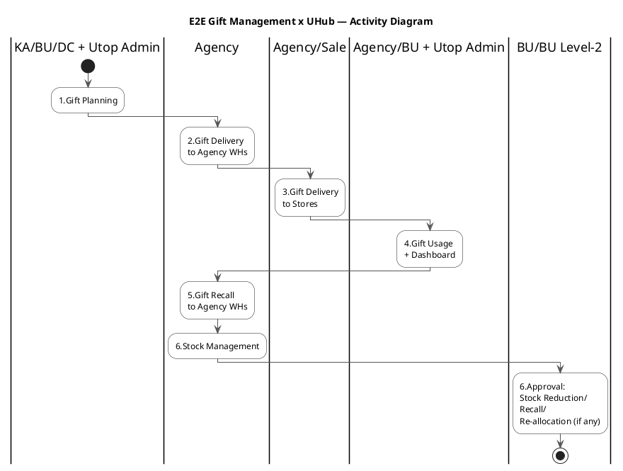

# Quy Trình - Gift Management System với UHub Integration

## Tổng Quan Quy Trình

Quy trình Gift Management E2E bao gồm 7 giai đoạn chính từ lập kế hoạch đến quản lý kho:

```
B1. Gift Planning
 → B2. Gift Delivery to Agency
  → B3. Gift Delivery to Stores
   → B4. Gift Usage
    → B5. Gift Recall
     → B6. Stock Management
      → B7. Stock Adjustment
```

## Tổng Quan Bảng Quy Trình

|  | B1.Gift Planning | B2.Gift Delivery to Agency WHs | B3.Gift Delivery to Stores | B4. Gift Usage | B5. Gift Recall to Agency WHs | B6. Stock Management | B7. Stock Reduction/Recall/ Re-allocation (if any) |
| --- | --- | --- | --- | --- | --- | --- | --- |
| KA | 1.Customer Alignment (Gift Recall Alignment) |  |  |  |  |  |  |
| BU | 2.Setup Gift on UGMS<br>3.Sync UGMS → UHub<br>4.Request Setup Campaign on ITU Log Form<br>5.Sync ITU Log Form → UHub Admin | **6.BU Review & Approval Tickets**<br>- Agency tickets (≤168h before live)<br>- Sales tickets (≤48h before live)<br>- 24h/12h approval SLA | | 11.BU xem UHub PowerBI Report<br>- Gift Report (NEW)<br>- Campaign Performance<br>+ 12.**BU Trigger Operations**<br>- Gift transfer between stores<br>- Agency changes |  |  | 17.**BU Raise & Forward Ticket**<br>via Email (Level-2 Approval)<br>+ UHub auto email alerts |
| BU Level-2 |  |  |  |  |  |  | 18.Review & Approval Ticket via Email<br>**(NEW: Approval with evidences)** |
| Utop Admin | 6.Cập nhật thông tin campaign<br>trên Utop Admin Portal<br>+ **Email BU theo Scheme ID** | | | 12.**UTOP Setup & Go-live Campaign**<br>**LOOP until Campaign ready = Yes**<br>(Campaign readiness gate)<br>theo Request của BU | |  | 19.**Utop Admin Confirm Ticket**<br>Sync UHub ↔ UGMS<br>(Điều chỉnh tồn + evidences) |
| DC | 7.Linfox Delivery → Agency WHs |  |  |  |  |  |  |
| Agency |  | 8.Nhận & kiểm tra hàng<br>**9.Agency Ticket System**<br>- Confirm theo Gift Vol (normal)<br>- Tạo ticket số thực tế + nguyên nhân<br>Xuất Allocation by store | 10.Deliver to Stores<br>theo Allocation by store | 13.PG operates campaign on UHub<br>(Sampling & Redemption) | 14.Recall Gifts to Agency WHs<br>(5 ngày sau end-campaign) | 15.Kiểm tra hàng thu hồi<br>16.**Agency Reconciliation**<br>- Digital Confirm report đối soát (normal)<br>=> Sync UHub ↔ UGMS​<br>- Submit ticket discrepancy |  |
| Sales |  |  | 11.Kiểm tra hàng<br>**12.Sales Ticket System**<br>- Confirm theo Allocation (normal)<br>- Tạo ticket số thực tế + nguyên nhân |  |  |  |  |


## Flow Tổng Quan Bảng Quy Trình

